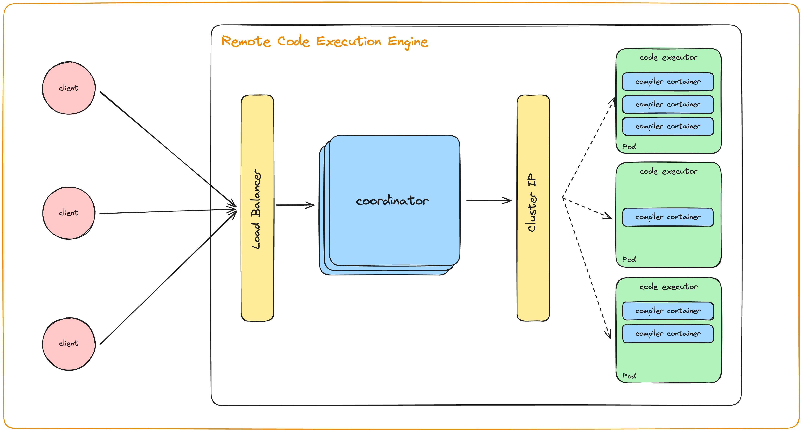

# TryTok: Remote Code Execution Engine for Tok

TryTok is a remote code execution engine for a toy programming language that I built, called [Tok](https://github.com/JyotinderSingh/ctok/tree/master).

## Architecture



The architecture of TryTok is simple. It consists of two main components:

1. **Coordinator**: The coordinator is responsible for coordinating the execution of code. It accepts code from the user, sends it to one of the code Executors for execution, and returns the result to the user.

1. **Code Executor**: The code executor executes the code that is sent to it by the Coordinator. It is a stateless component that can be scaled horizontally to handle multiple requests. The executor internally launches a lightweight container to execute code for each request to ensure isolation.

We use kubernetes to deploy these components and maintain multiple replicas of the Code Executor.

## Local Setup

You will need minikube installed for this setup.

```bash
brew install minikube
```

### Helm

Ensure helm is installed.

```bash
brew install helm
```

Refer to the helm setup [here](./infra/helm/README.md).

### Just K8s

Refer to the k8s setup [here](./infra/k8s/README.md).

## Sending a Request

Once the setup is complete, you can send a request to the coordinator to execute code. The coordinator is exposed at `localhost:8080`. You can send a `POST` request to this endpoint with the code that you want to execute in the body of the request.

```bash
curl --location 'http://127.0.0.1:52604/execute' \
--header 'Content-Type: text/plain' \
--data 'print "Hello, World!";'
```

The above request should be successfully routed to one of the executors, and you should receive the output of the code execution in the response.

```bash
Hello, World!
```
